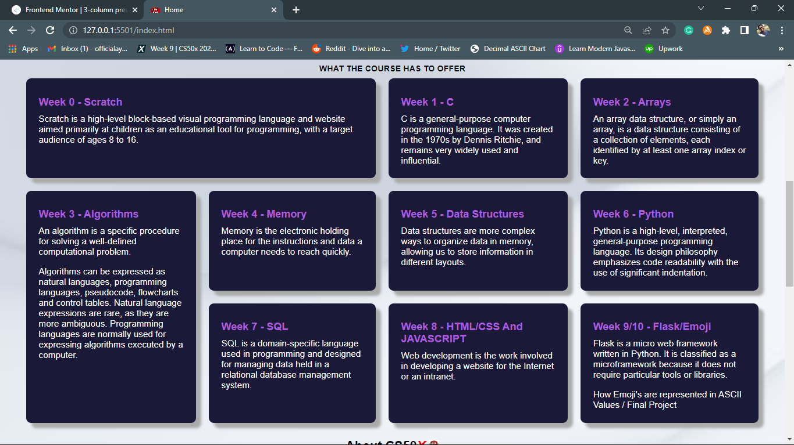

# Overview

## What is CS50?

CS50 is an on-campus and online introductory course on computer science taught at Harvard University and Yale University. In 2016, CS50 became available to high school students as an Advanced Placement Computer Science course.

## About

This was my Week 8 project Assignment given to me while taking the CS50 Course. I was told to build a website with 3 pages or more, so I decided to build a website talking about how great CS50 is itself. I am fully open to reviews about this.

If there's any way you feel I could improve this, please do let me know.
